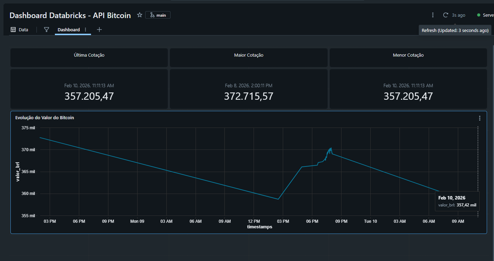
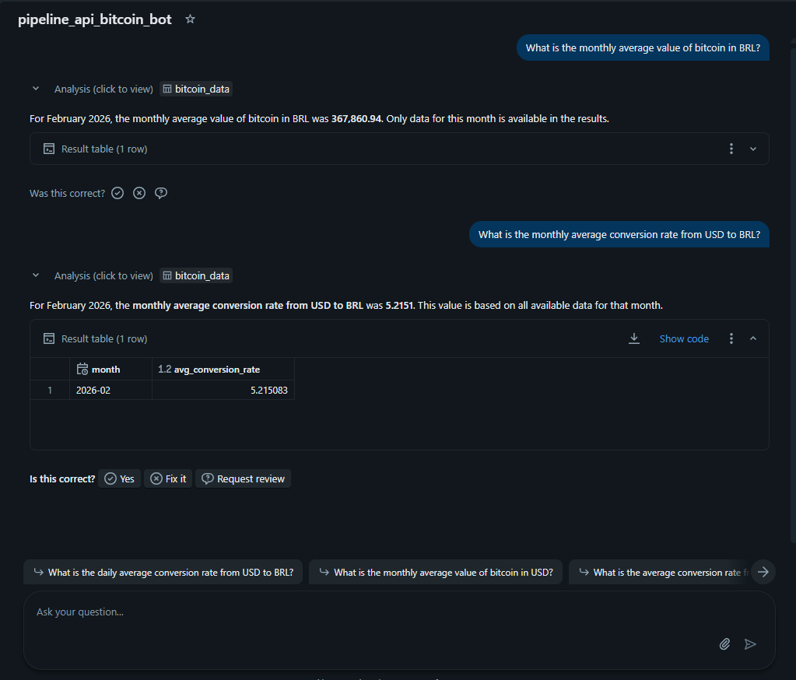
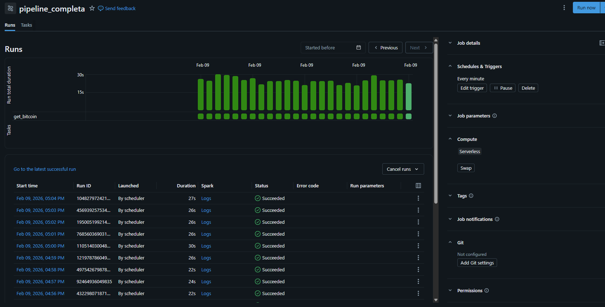

# 🚀 ETL com Python, SQL e Databricks usando API

Projeto de **ETL (Extract, Transform, Load)** desenvolvido com foco em coleta de dados em tempo quase real, enriquecimento e visualização analítica no **Databricks**.

---

## 🎯 Objetivo

Extrair dados atualizados do **Bitcoin** e da **cotação atual**, realizar o **enriquecimento dos dados** e armazená-los em uma **Delta Table** no Databricks.  
Ao final do processo, os dados são consumidos em um **dashboard simples**, criado diretamente na plataforma.

---

## 🛠️ Tecnologias Utilizadas

- **Python** 🐍  
- **SQL**
- **Databricks**
- **Delta Lake**
- **API externa** (para obtenção dos dados)
- **Dashboard nativo do Databricks**

---

## 🔄 Fluxo do ETL

1. **Extração**
   - Consumo de dados via API
   - Coleta do valor atual do Bitcoin e informações de cotação

2. **Transformação**
   - Limpeza e padronização dos dados
   - Enriquecimento com informações adicionais (ex: timestamp, variação, etc.)

3. **Carga**
   - Persistência dos dados em uma **Delta Table**
   - Garantia de histórico e versionamento

4. **Visualização**
   - Criação de um dashboard simples no Databricks
   - Análise da evolução do valor do Bitcoin ao longo do tempo

---

## 📊 Dashboard

> Print do dashboard criado no Databricks

---

## 👽 Genie

---

## ⚙️ Execuções do Job

> Exemplos de execuções bem-sucedidas do job de ETL

---

## 📌 Observações

- O projeto foi desenvolvido com foco em **boas práticas de ETL**
- Estrutura pensada para facilitar escalabilidade e manutenção
- Ideal para estudos de **engenharia de dados** e pipelines analíticos

---

## 📚 Próximos Passos (opcional)

- Gerar Dashboard simples no Power BI 
